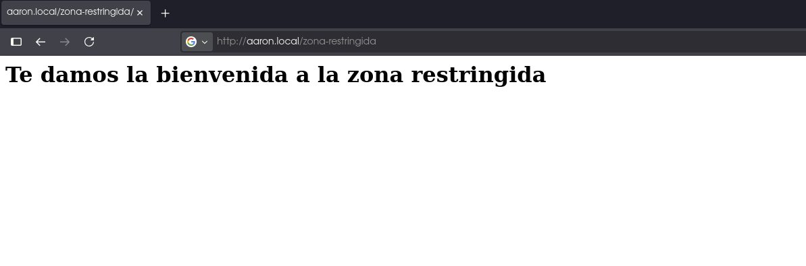
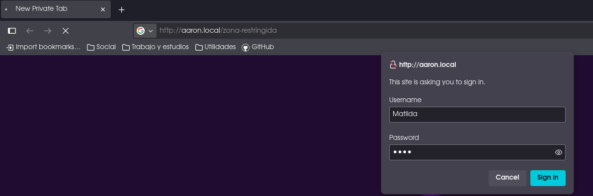
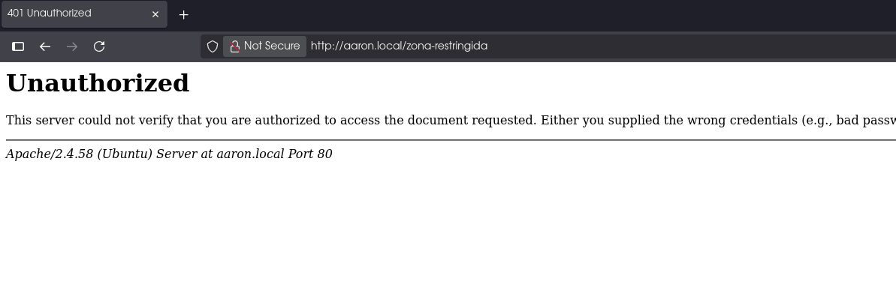
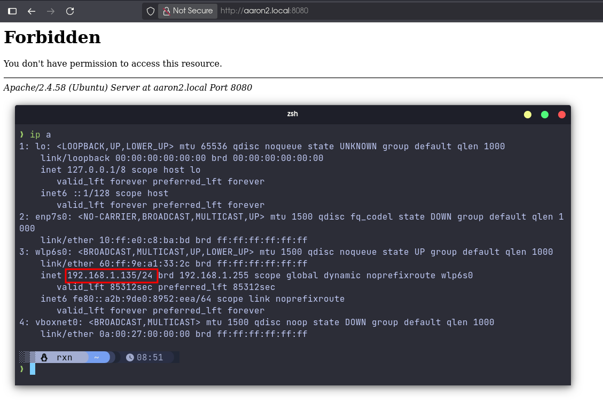
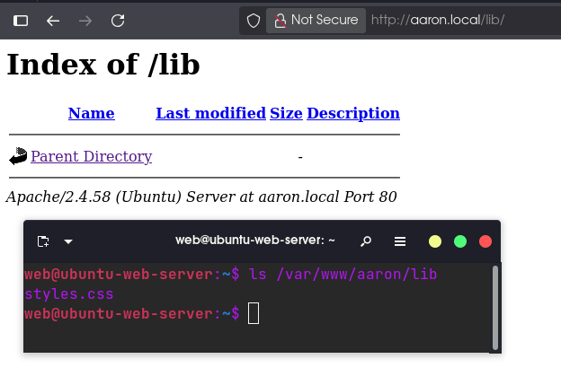
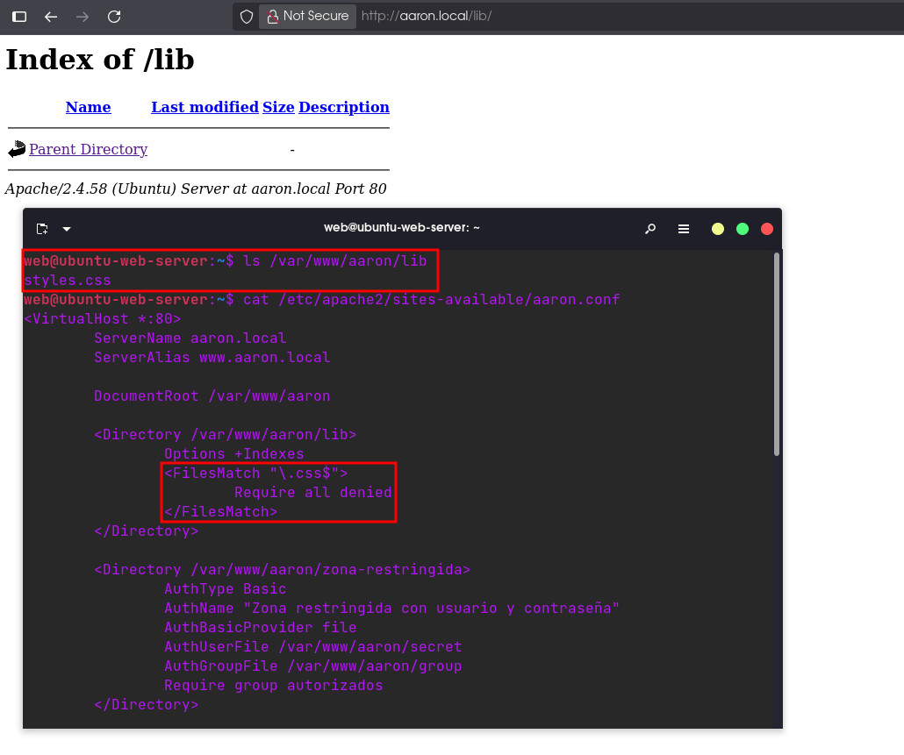
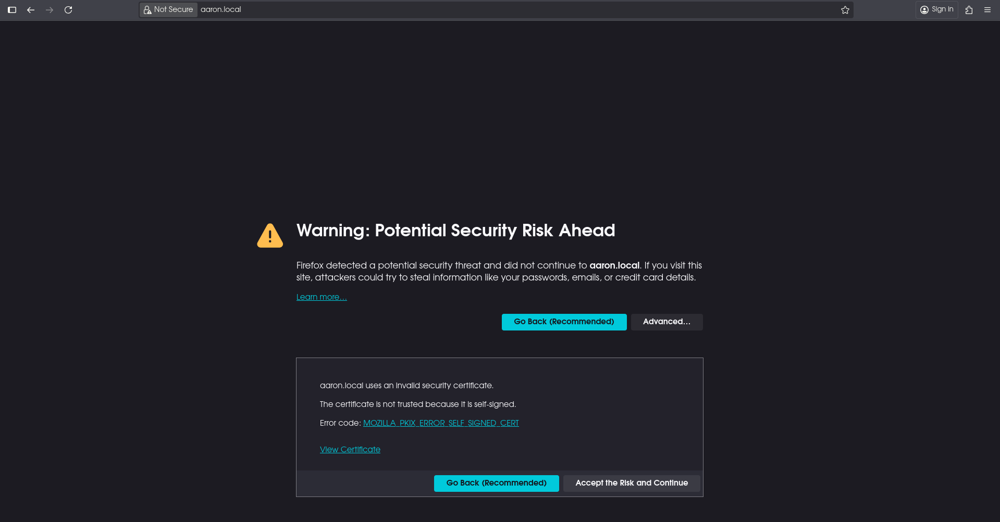
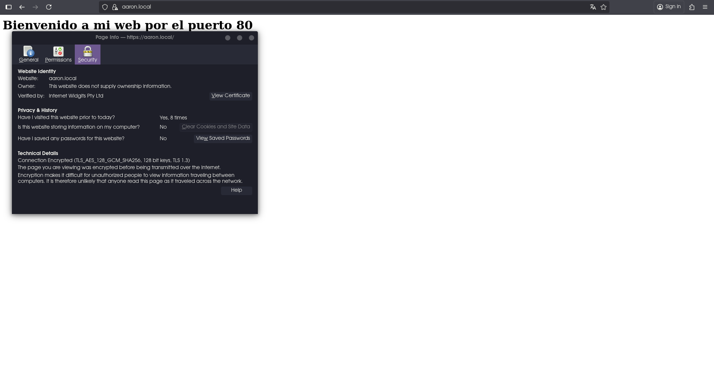
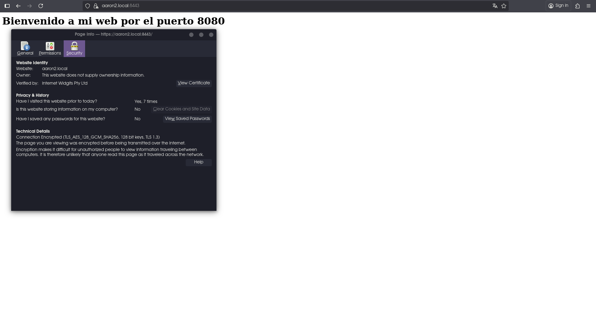

# Apuntes Apache2

## 📑 Contenidos

1. [🔎 ¿Qué es Apache2?](#que-es-apache2)
2. [🌐 Protocolos HTTP y HTTPS](#protocolos-http-y-https)
3. [👤 Usuario](#usuario)
4. [💻 Conexión remota con el servidor](#conexión-remota-con-el-servidor)
5. [🛠️ Instalación](#instalación)
6. [⚙️ Configuraciones](#configuraciones)
   - [📝 Archivo /etc/apache2/ports.conf](#archivo-etcapache2portsconf)
   - [🏠 Configuración inicial del sitio](#configuración-inicial-del-sitio)
   - [📒 Archivo /etc/hosts](#archivo-etchosts)
   - [🔍 Prueba de configuración inicial](#prueba-de-configuración-inicial)
7. [🔒 Configurar acceso restringido](#configuración-de-restricciones)
   - [🙎‍♂️ Acceso restringido por usuarios](#acceso-restringido-por-usuarios)
   - [👥 Acceso restringido por grupos](#acceso-restringido-por-grupos)
   - [🚫 Allow y Deny - Restricción por IP](#allow-y-deny)
8. [❌ Página de error personalizada](#página-de-error-personalizada)
9. [🔐 Activar SSL](#activar-ssl)
10. [📚 Recursos recomendados](#-recursos-recomendados)

## 🔎 ¿Qué es Apache2?
<a id="que-es-apache2"></a>
**Apache2** es un **servidor web** muy utilizado en sistemas Linux.
Su función principal es servir páginas web a través de los protocolos **HTTP y HTTPS**.

## 🌐 Protocolos HTTP y HTTPS
<a id="protocolos-http-y-https"></a>
Siglas de **HyperText Transfer Protocol**, transfiere principalmente documentos HTML y multimedia.
**HTTPS** es la **versión segura** de HTTP.

### Puertos

```
HTTP --> Puerto 80
HTTPS --> Puerto 443
```

## 👤 Usuario
<a id="usuario"></a>

Apache2 utiliza el usuario <code>www-data</code>.

## 💻 Conexión remota con el servidor
<a id="conexión-remota-con-el-servidor"></a>

Para trabajar de forma más comoda con nuestro servidor podemos usar ssh para conectarnos desde nuestro terminal de forma remota al servidor:

```bash
ssh web@192.168.1.130
```

<code>ssh &lt;usuario&gt;@&lt;IP-Servidor&gt; </code>

Nos pedirá añadir el fingerprint y la contraseña del usuario remoto.

## 🛠️ Instalación
<a id="instalación"></a>

Para la instalación de Apache2 es recomendable que nuestro servidor disponga de una **IP fija**, podemos configurarla desde el archivo **Netplan**:

```bash
sudo nano /etc/netplan/50-cloud-init.yaml
```

**Nota**: Es posible que el archivo también pueda llevar el nombre <code>00-installer-config.yaml</code>, pero la ubicación del archivo será siempre en <code>/etc/netplan</code>, se deberá editar el arrchivo ubicado en ese directorio.

**Ejemplo de configuración de Netplan**:

```bash
# This file is generated from information provided by the datasource.  Changes
# to it will not persist across an instance reboot.  To disable cloud-init's
# network configuration capabilities, write a file
# /etc/cloud/cloud.cfg.d/99-disable-network-config.cfg with the following:
# network: {config: disabled}
network:
    ethernets:
        enp0s3:
            dhcp4: no
            addresses:
              - 192.168.1.130/24
            routes:
              - to: default
                via: 192.168.1.1
            nameservers:
              addresses: [8.8.8.8,8.8.4.4]
    version: 2
```

<code>enp0s3</code> --> Puerto Ethernet del servidor donde se hará la configuración.

<code>dhcp4: no</code> --> **Desactivamos la asignación de IPv4 por DHCP**, de esta forma podremos configurarla manualmente.

<code>addresses</code> --> **Asignación de direcciones IP**, se puede asignar más de una.

<code>routes</code> --> **Asignación del gateway**, normalmente será la dirección IP del Router. Puedes averiguar la IP del gateway de tu red usando el comando <code>ip route | grep default</code>:

```bash
rxn@pop-os:~$ ip route | grep default
default via 192.168.1.1 dev wlp6s0 proto dhcp metric 600 
```

Nuestro gateway es <code>192.168.1.1</code>

<code>nameservers</code> --> **Asignación de servidores DNS**, se puede asignar más de uno.

Una vez hayas configurado todo aplica los cambios y comprueba tu ip, si no sale ningún error lo has configurado correctamente:

```bash
web@ubuntu-web-server:~$ sudo netplan apply
[sudo] password for web: 
web@ubuntu-web-server:~$ ip a
1: lo: <LOOPBACK,UP,LOWER_UP> mtu 65536 qdisc noqueue state UNKNOWN group default qlen 1000
    link/loopback 00:00:00:00:00:00 brd 00:00:00:00:00:00
    inet 127.0.0.1/8 scope host lo
       valid_lft forever preferred_lft forever
    inet6 ::1/128 scope host noprefixroute 
       valid_lft forever preferred_lft forever
2: enp0s3: <BROADCAST,MULTICAST,UP,LOWER_UP> mtu 1500 qdisc pfifo_fast state UP group default qlen 1000
    link/ether 08:00:27:9c:b5:06 brd ff:ff:ff:ff:ff:ff
    inet 192.168.1.130/24 brd 192.168.1.255 scope global enp0s3
       valid_lft forever preferred_lft forever
    inet6 fe80::a00:27ff:fe9c:b506/64 scope link 
       valid_lft forever preferred_lft forever
web@ubuntu-web-server:~$ 
```

[**Documentación oficial de Cannonical**](https://netplan.io/)

Si tu distribución es **Debian** o alguna otra **no basada en Ubuntu** o que **no disponga de Netplan** entonces se deberá configurar el archivo <code>/etc/network/interfaces</code>.

**Ejemplo de configuración de Interfaces**:

```bash
# Configuración de red estática para Debian
auto enp0s3
iface enp0s3 inet static
    address 192.168.1.130
    netmask 255.255.255.0
    gateway 192.168.1.1
    dns-nameservers 8.8.8.8 8.8.4.4

```

Luego reinicia la red con:

```bash
sudo systemctl restart networking
```

[**Guia de nixCraft sobre /etc/network/interfaces**](https://www.cyberciti.biz/faq/setting-up-an-network-interfaces-file/)

Ahora sí podremos instalar Apache:

```bash
sudo apt install apache2 -y
```

Ahora si accedemos a la ip del servidor desde el navegador veremos la página por defecto de Apache, indicando que se ha instalado correctamente:


## ⚙️ Configuraciones
<a id="configuraciones"></a>

### 📝 Archivo /etc/apache2/ports.conf
<a id="archivo-etcapache2portsconf"></a>

```apache
# If you just change the port or add more ports here, you will likely also
# have to change the VirtualHost statement in
# /etc/apache2/sites-enabled/000-default.conf

Listen 80

<IfModule ssl_module>
	Listen 443
</IfModule>

<IfModule mod_gnutls.c>
	Listen 443
</IfModule>
```

Sirve para configurar que puertos escuchará el servidor web y bajo que condiciones usando la etiqueta <code>IfModule</code>:

```apache
# If you just change the port or add more ports here, you will likely also
# have to change the VirtualHost statement in
# /etc/apache2/sites-enabled/000-default.conf

Listen 80
Listen 8080

<IfModule ssl_module>
        Listen 443
        Listen 8443
</IfModule>

<IfModule mod_gnutls.c>
        Listen 443
</IfModule>
```

Recargamos la configuración de Apache:

```bash
sudo systemctl reload apache2
```

Ahora escuchará por los puertos **80** y **8080** para **HTTP** y **443** y **8443** para **HTTPS** cuando el **módulo SSL esté activo**, podemos ver esto claro con el comando <code>ss -punta</code>:

```bash
web@ubuntu-web-server:~$ ss -punta
Netid State  Recv-Q Send-Q          Local Address:Port             Peer Address:Port                                   Process                                  
udp   UNCONN 0      0                  127.0.0.54:53                    0.0.0.0:*                                                                               
udp   UNCONN 0      0               127.0.0.53%lo:53                    0.0.0.0:*                                                                               
tcp   LISTEN 0      4096               127.0.0.54:53                    0.0.0.0:*                                                                               
tcp   LISTEN 0      4096                  0.0.0.0:22                    0.0.0.0:*                                                                               
tcp   LISTEN 0      4096            127.0.0.53%lo:53                    0.0.0.0:*                                                                               
tcp   LISTEN 0      511                         *:8080                        *:*                                                                               
tcp   LISTEN 0      4096                     [::]:22                       [::]:*                                                                               
tcp   LISTEN 0      511                         *:80                          *:*                                                                               
tcp   ESTAB  0      0      [::ffff:192.168.1.130]:22     [::ffff:192.168.1.135]:43576   
```

Como el módulo SSL no está activo solo veremos los puertos que escucha HTTP, que son el 80 y el 8080 como hemos configurado anteriormente.

Si activamos el módulo SSL y recargamos la configuración veremos los puertos configurados para el módulo:

```bash
web@ubuntu-web-server:~$ sudo a2enmod ssl
[sudo] password for web: 
Considering dependency mime for ssl:
Module mime already enabled
Considering dependency socache_shmcb for ssl:
Enabling module socache_shmcb.
Enabling module ssl.
See /usr/share/doc/apache2/README.Debian.gz on how to configure SSL and create self-signed certificates.
To activate the new configuration, you need to run:
  systemctl restart apache2
web@ubuntu-web-server:~$ sudo systemctl reload apache2
web@ubuntu-web-server:~$ ss -punta
Netid State   Recv-Q  Send-Q   Local Address:Port    Peer Address:Port  Process 
udp   UNCONN  0       0           127.0.0.54:53           0.0.0.0:*             
udp   UNCONN  0       0        127.0.0.53%lo:53           0.0.0.0:*             
tcp   LISTEN  0       4096           0.0.0.0:22           0.0.0.0:*             
tcp   LISTEN  0       4096        127.0.0.54:53           0.0.0.0:*             
tcp   LISTEN  0       4096     127.0.0.53%lo:53           0.0.0.0:*             
tcp   ESTAB   0       0        192.168.1.130:22     192.168.1.135:33486         
tcp   LISTEN  0       511                  *:80                 *:*             
tcp   LISTEN  0       4096              [::]:22              [::]:*             
tcp   LISTEN  0       511                  *:8443               *:*             
tcp   LISTEN  0       511                  *:443                *:*             
tcp   LISTEN  0       511                  *:8080               *:*  
```

Ahora ya aparecen los puertos seguros para HTTPS.

Si quiseramos desactivar el módulo deberiamos utilizar el siguiente comando:

```bash
sudo a2dismod ssl
```

### 🏠 Configuración inicial del sitio
<a id="configuración-inicial-del-sitio"></a>

**Directorios importantes:**

- <code>/etc/apache2/sites-enabled</code>

- <code>/etc/apache2/sites-available</code>

En <code>sites-available</code> crearemos las configuraciones con sus respectivos **VirtualHost**, cuando activemos las configuraciones se crearan enlaces simbolicos en <code>sites-enabled</code>.

Primero desactivaremos la configuración por defecto y crearemos una nueva:

```bash
sudo a2disstie 000-default.conf
sudo nano /etc/apache2/sites-available/aaron.conf
```

```apache
<VirtualHost *:80>
        ServerName aaron.local    
        ServerAlias www.aaron.local

        DocumentRoot /var/www/aaron

        <Directory /var/www/aaron/lib>
                Options -Indexes
        </Directory>

        ErrorLog ${APACHE_LOG_DIR}/aaron-error.log
        CustomLog ${APACHE_LOG_DIR}/aaron-access.log combined
</VirtualHost>

<VirtualHost *:8080>
        ServerName aaron2.local
        ServerAlias www.aaron2.local

        DocumentRoot /var/www/aaron2

        <Directory /var/www/aaron2/lib>
                Options +Indexes
        </Directory>

        ErrorLog ${APACHE_LOG_DIR}/aaron2-error.log
        CustomLog ${APACHE_LOG_DIR}/aaron2-access.log combined
</VirtualHost>

<IfModule mod_ssl.c>
        <VirtualHost *:443>

        </VirtualHost>

        <VirtualHost *:8443>

        </VirtualHost>
</IfModule>
```

De momento no utilizaremos los <code>VirtualHost</code> para HTTPS, centremonos en los HTTP puerto 80 y 8080.

<code>*</code> --> Cualquier IP. Podemos poner una especifica si es necesario.

<code>80/8080</code> --> Puerto por el que se accede

<code>ServerName</code> --> Nombre con el cual se puede acceder al sitio en lugar de la IP.

<code>ServerAlias</code> --> Nombre alternativo con el cual podemos acceder al servidor.

<code>DocumentRoot</code> --> Ubicación donde se sirven los archivos HTML de la página.

<code>Directory</code> --> Directivas que afectan al directorio especificado en la etiqueta.

<code>Options +/- Indexes</code> --> Sirve par activar o desactivar el listado del contenido del directorio en caso de que no se encuentre un archivo <zcode>index.html</code>

<code>ErroLog y CustomLog</code> --> Logs del sitio. Es recomendable tener logs independientes por cada VirtualHost.

Ahora creamos los directorios y archivos, habilitamos la configuración y recargamos la configuración:

```bash
web@ubuntu-web-server:/etc/apache2$ sudo mkdir -p /var/www/aaron/lib
web@ubuntu-web-server:/etc/apache2$ sudo mkdir -p /var/www/aaron2/lib
web@ubuntu-web-server:/etc/apache2$ ls -la /var/www/
total 20
drwxr-xr-x  5 root root 4096 nov 11 13:59 .
drwxr-xr-x 14 root root 4096 nov 10 09:57 ..
drwxr-xr-x  3 root root 4096 nov 11 13:58 aaron
drwxr-xr-x  3 root root 4096 nov 11 13:59 aaron2
drwxr-xr-x  2 root root 4096 nov 10 09:57 html
web@ubuntu-web-server:/etc/apache2$ sudo nano /var/www/aaron/index.html 
# Aqui creamos los archivos e introducimos el contenido
web@ubuntu-web-server:/etc/apache2$ sudo nano /var/www/aaron2/index.html
web@ubuntu-web-server:/etc/apache2$ cat /var/www/aaron/index.html 
<h1>Bienvenido a mi web por el puerto 80</h1>
web@ubuntu-web-server:/etc/apache2$ cat /var/www/aaron2/index.html 
<h1>Bienvenido a mi web por el puerto 8080</h1>
web@ubuntu-web-server:/etc/apache2$ sudo a2ensite aaron.conf 
Enabling site aaron.
To activate the new configuration, you need to run:
  systemctl reload apache2
web@ubuntu-web-server:/etc/apache2$ sudo systemctl reload apache2
```

### 📒 Archivo /etc/hosts
<a id="archivo-etchosts"></a>

Como no disponemos de servidor DNS ni tenemos nuestro sitio en un hosting externo utilizaremos el archivo /etc/hosts en nuestra máquina y en el servidor para reconocer <code>ServerName</code> y <code>ServerAlias</code>.

```bash
sudo nano /etc/hosts
```

**Cliente**:

```bash
# See `man hosts` for details.
#
# By default, systemd-resolved or libnss-myhostname will resolve
# localhost and the system hostname if they're not specified here.
127.0.0.1       localhost
::1             localhost
192.168.1.135   pop-os
192.168.1.130   aaron.local     aaron2.local    www.aaron.local         www.aaron2.local
```

**Servidor**:

```bash
127.0.0.1 localhost
127.0.1.1 ubuntu-web-server
127.0.1.1       aaron.local     aaron2.local    www.aaron.local         www.aaron2.local
# The following lines are desirable for IPv6 capable hosts
::1     ip6-localhost ip6-loopback
fe00::0 ip6-localnet
ff00::0 ip6-mcastprefix
ff02::1 ip6-allnodes
ff02::2 ip6-allrouters
```

### 🔍 Prueba de configuración inicial
<a id="prueba-de-configuración-inicial"></a>

Ahora si intentamos acceder al sitio desde los nombres especificados y sus puertos veremos que funciona correctamente:

**aaron.local y www.aaron.local**:


**aaron2.local:8080 y www.aaron2.local:8080**:


Si intenamos acceder al index de lib del puerto 80 y 8080 deberia pasar lo siguiente:

- Puerto 80: <code>403 Forbidden</code>


- Puerto 8080: Listará el contenido del directorio.


Esta restricción **solo afecta al listado del directorio por parte del cliente**, no afecta en los recursos que pueda utilizar la página. Por ejemplo, si añadimos una hoja de estilos CSS en aaron.local/lib siempre y cuando el documento HTML tenga la etiqueta link apuntando hacia el archivo CSS adoptará los estilos.

```css
body { 
        background-color: black;
        color: white;
}
```

```html
<link rel="stylesheet" href="lib/styles.css">
<h1>Bienvenido a mi web por el puerto 80</h1>
```

Sin recargar la configuración, si ahora accedemos a la página del puerto 80 veremos que los estilos se han aplicado sin problemas:


### 🔒 Configurar acceso restringido
<a id="configuración-de-restricciones"></a>

Es posible configurar restricciones en nuestro servidor web a diferentes niveles como por ejemplo, por usuarios, grupos o direcciones IP...

#### 🙎‍♂️ Acceso restringido por usuarios
<a id="acceso-restringido-por-usuarios"></a>

Usando la etiqueta <code>Directory</code> en la configuración de nuestro sitio y el comando <code>htpasswd</code> podemos crear una restricción por usuarios, cuando se intente acceder al sitio restringido se pedirá un usuario y contraseña:

```bash
web@ubuntu-web-server:/var/www/aaron$ sudo htpasswd -c secret Aaron
New password: 
Re-type new password: 
Adding password for user Aaron
web@ubuntu-web-server:/var/www/aaron$ sudo htpasswd secret Matilda
New password: 
Re-type new password: 
Adding password for user Matilda
web@ubuntu-web-server:/var/www/aaron$ cat secret 
Aaron:$apr1$zcorPY/y$6mvrMl2EDURj0OiYDQ34f1
Matilda:$apr1$PQYCNAzl$v7O/NY9euvWBC5aoNuqjV.
```

Creamos el archivo <code>secret</code> (puedes ponerle cualquier nombre) usando el parámetro <code>-c</code> del comando <code>htpasswd</code>, es importante introducir un usuario en la creación, si no se hace no se creará el archivo.

```bash
sudo htpasswd -c <nombre-archivo> <usuario>
```

Para sobreescribir el archivo y añadir un nuevo usuario repetimos el proceso **sin el parámetro <code>-c</code>**.

```bash
sudo htpasswd <nombre-archivo> <usuario>
```

Los usuarios se guardaran con los nombres asignados y con las contraseñas hasheadas.

Ahora crearemos un sitio de prueba dentro de aaron.local (Puerto 80) para probar esta restricción:

```bash
web@ubuntu-web-server:/var/www/aaron$ sudo mkdir zona-restringida
web@ubuntu-web-server:/var/www/aaron$ sudo nano zona-restringida/index.html
web@ubuntu-web-server:/var/www/aaron$ cat zona-restringida/index.html 
<h1>Te damos la bienvenida a la zona restringida</h1>
```

Editamos la configuración:

```apache
<VirtualHost *:80>
        ServerName aaron.local
        ServerAlias www.aaron.local

        DocumentRoot /var/www/aaron

        <Directory /var/www/aaron/lib>
                Options -Indexes
        </Directory>

        <Directory /var/www/aaron/zona-restringida>
                AuthType Basic
                AuthName "Zona restringida con usuario y contraseña"
                AuthBasicProvider file
                AuthUserFile /var/www/aaron/secret
                Require valid-user
        </Directory>

        ErrorLog ${APACHE_LOG_DIR}/aaron-error.log
        CustomLog ${APACHE_LOG_DIR}/aaron-access.log combined
</VirtualHost>
```

Recargamos la configuración y probamos acceder a la zona restringida:

**Login correcto**:


**Login incorrecto**:

Probaremos con un usuario inexistente, pero no aceptará tampoco si se falla la contraseña de un usuario existente en el alert:


El alert del navegador seguirá apareciendo hasta que se introduzcan credenciales válidos, si cancelamos saltará **Error 401 Unauthorized**.

#### 👥 Acceso restringido por grupos
<a id="acceso-restringido-por-grupos"></a>

Con los usuarios creados podemos crear grupos y restringir el acceso a los usuarios que no pertenezcan a un grupo especifico.

Para ello habilitaremos el módulo <code>authz_groupfile</code> y crearemos un archivo con los grupos y los usuarios que pertenecen a estos:

```bash
web@ubuntu-web-server:/var/www/aaron$ sudo a2enmod authz_groupfile 
[sudo] password for web: 
Considering dependency authz_core for authz_groupfile:
Module authz_core already enabled
Enabling module authz_groupfile.
To activate the new configuration, you need to run:
  systemctl restart apache2
web@ubuntu-web-server:/var/www/aaron$ sudo touch group
web@ubuntu-web-server:/var/www/aaron$ sudo nano group
web@ubuntu-web-server:/var/www/aaron$ cat group
autorizados: Aaron
no: Matilda
web@ubuntu-web-server:/var/www/aaron$ sudo systemctl restart apache2
```

Ahora modificamos la configuración:

```apache
<VirtualHost *:80>
        ServerName aaron.local
        ServerAlias www.aaron.local

        DocumentRoot /var/www/aaron

        <Directory /var/www/aaron/lib>
                Options -Indexes
        </Directory>

        <Directory /var/www/aaron/zona-restringida>
                AuthType Basic
                AuthName "Zona restringida con usuario y contraseña"
                AuthBasicProvider file
                AuthUserFile /var/www/aaron/secret
                AuthGroupFile /var/www/aaron/group
                Require group autorizados
        </Directory>

        ErrorLog ${APACHE_LOG_DIR}/aaron-error.log
        CustomLog ${APACHE_LOG_DIR}/aaron-access.log combined
</VirtualHost>
```

**Cambios**:

- Se ha añadido la directiva <code>AuthGroupFile</code> para indicar la ubiación del archivo que contiene los grupos y sus miembros.
- Se ha reemplazado <code>Require valid-user</code> por <code>Require group autorizados</code>, indicando que ahora solo se aceptarán usuarios válido **y que pertenezcan al grupo o grupos indicados**.

Recargamos la configuración y probamos el login.

**Login correcto**:




**Login incorrecto**:





Exacto 👏 buena observación.
Las directivas `Allow` y `Deny` **no se pueden usar directamente dentro de `<VirtualHost>`**, solo funcionan dentro de contextos como `<Directory>`, `<Files>` o `<Location>` (porque son directivas del módulo `mod_access_compat`).

Aquí tienes la versión **corregida y explicada correctamente**, lista para tus apuntes:

---

### 🚫 Allow y Deny - Restricción por IP
<a id="allow-y-deny"></a>

Las directivas **Allow** y **Deny** sirven para **restringir el acceso por dirección IP**.
A diferencia de la autenticación por usuarios o contraseñas, este método controla **desde qué equipos se puede acceder al sitio**.

Por ejemplo, para permitir el acceso desde cualquier dirección excepto desde `192.168.1.135`, podríamos escribir:

```apache
<VirtualHost *:8080>
    ServerName aaron2.local
    ServerAlias www.aaron2.local

    DocumentRoot /var/www/aaron2

    <Directory /var/www/aaron2>
        Allow from all
        Deny from 192.168.1.135
    </Directory>

    ErrorLog ${APACHE_LOG_DIR}/aaron2-error.log
    CustomLog ${APACHE_LOG_DIR}/aaron2-access.log combined
</VirtualHost>
```

En este caso:

* `Allow from all` permite el acceso a todos los clientes.
* `Deny from 192.168.1.135` bloquea el acceso solo a esa IP.

El orden es importante: primero se permite el acceso general y luego se aplica la denegación a la IP concreta.

También podríamos hacerlo al revés, bloqueando todo con:

```apache
Deny from all
Allow from 192.168.1.100
```

para que **solo la IP `192.168.1.100`** pueda acceder al sitio.

Si probamos desde la IP bloqueada (`192.168.1.135`), el acceso será **denegado**, mientras que desde cualquier otra IP sí se podrá entrar:



Si no nos funciona restringir de esta forma podemos usar la directiva <code>Order</code> para especificar si se aplica antes Allow o Deny:

```apache
<VirtualHost *:8080>
    ServerName aaron2.local
    ServerAlias www.aaron2.local

    DocumentRoot /var/www/aaron2

    <Directory /var/www/aaron2>
	Order allow,deny
	Allow from all
        Deny from 192.168.1.135
    </Directory>

    ErrorLog ${APACHE_LOG_DIR}/aaron2-error.log
    CustomLog ${APACHE_LOG_DIR}/aaron2-access.log combined
</VirtualHost>
```

<code>Order allow,deny</code> --> Primero revisará que equipos pueden entrar y luego restringirá las direcciones IP especificadas.

También podemos ocultar archivos cuando se lista el directorio con la etiqueta <code>&lt;Files&gt;</code>, para este ejemplo usaremos el sitio del puerto 80 y bloquearemos la visualización de archivos CSS para todos:

```apache
<VirtualHost *:80>
	ServerName aaron.local
	ServerAlias www.aaron.local

	DocumentRoot /var/www/aaron

	<Directory /var/www/aaron/lib>
		Options +Indexes
		<Files *.css>
			Deny from all
		</Files>
	</Directory>
	
	<Directory /var/www/aaron/zona-restringida>
		AuthType Basic
		AuthName "Zona restringida con usuario y contraseña"
		AuthBasicProvider file
		AuthUserFile /var/www/aaron/secret
		AuthGroupFile /var/www/aaron/group
		Require group autorizados
	</Directory>

	ErrorLog ${APACHE_LOG_DIR}/aaron-error.log
	CustomLog ${APACHE_LOG_DIR}/aaron-access.log combined
</VirtualHost>
```

Recargamos la configuración y veremos que en el directorio especificado hay un archivo CSS, pero cuando accedemos desde el navegador no vemos ninguno:



También funciona con la etiqueta <code>&lt;FilesMatch&gt;</code>:

```apache
<VirtualHost *:80>
        ServerName aaron.local
        ServerAlias www.aaron.local

        DocumentRoot /var/www/aaron

        <Directory /var/www/aaron/lib>
                Options +Indexes
                <FilesMatch "\.css$">
                        Require all denied
                </FilesMatch>
        </Directory>

        <Directory /var/www/aaron/zona-restringida>
                AuthType Basic
                AuthName "Zona restringida con usuario y contraseña"
                AuthBasicProvider file
                AuthUserFile /var/www/aaron/secret
                AuthGroupFile /var/www/aaron/group
                Require group autorizados
        </Directory>

        ErrorLog ${APACHE_LOG_DIR}/aaron-error.log
        CustomLog ${APACHE_LOG_DIR}/aaron-access.log combined
</VirtualHost>
```

**Diferencias clave**: <code>&lt;FilesMatch&gt;</code> permite el uso de regex para seleccionar los archivos a permitir o restringir y usa el modo de restricción moderno con <code>Require</code>.

<code>Require all denied</code> --> Restringe el acceso a cualquier equipo. Podemos cambiar all por una IP cualquiera.

<code>Require all granted</code> --> Permite el acceso a cualquier equipo. Podemos cambiar all por una IP cualquiera.



### ❌ Página de error personalizada.
<a id="página-de-error-personalizada"></a>

Para esta sección utilizaremos de ejemplo la página de error creada en el directorio 404 de este repositorio, ahora mismo la tenemos en nuestro equipo:


Lo primero será pasar los archvios al servidor utilizando el comando <code>scp</code>:

```bash
rxn@pop-os:~/Code/rxnwashere_apuntes_apache2$ scp 404/* web@192.168.1.130:/home/web
web@192.168.1.130's password: 
404.jpg                                                             100%   52KB  44.0MB/s   00:00    
index.html                                                          100%  425     1.4MB/s   00:00    
styles.css                                                          100%  281   880.5KB/s   00:00 
```

Lo hacemos en la home del usuario del servidor ya que es un directorio con permisos para subir archvios por scp, algunos directorios nos pueden denegar el permiso de subida.

Ahora movemos los archivos al sitio donde queremos que esté la página de error y modificamos la configuración:

```bash
web@ubuntu-web-server:~$ ls
404.jpg  index.html  styles.css
web@ubuntu-web-server:~$ sudo mkdir -p /var/www/aaron2/error
[sudo] password for web: 
web@ubuntu-web-server:~$ sudo mv * /var/www/aaron2/error/
web@ubuntu-web-server:~$ ls /var/www/aaron2/error
404.jpg  index.html  styles.css
```

```apache
<VirtualHost *:8080>
    ServerName aaron2.local
    ServerAlias www.aaron2.local

    DocumentRoot /var/www/aaron2

    ErrorDocument 404 /error/index.html

    ErrorLog ${APACHE_LOG_DIR}/aaron2-error.log
    CustomLog ${APACHE_LOG_DIR}/aaron2-access.log combined
</VirtualHost>
```

Con la directiva <code>ErrorDocument</code> asignamos un error personalizado al código 404. La ruta del documento de error es relativa a <code>DocumentRoot</code>.

Como la ruta es relativa, esto afecta al documento HTML, por lo que todos los enlaces deben tener esta ruta, si no los estilos o las imagenes pueden no cargar correctamente:

```html
<!DOCTYPE html>
<html lang="en">
<head>
    <meta charset="UTF-8">
    <meta name="viewport" content="width=device-width, initial-scale=1.0">
    <title>404 - NOT FOUND</title>
    <link rel="stylesheet" href="/error/styles.css">
</head>
<body>

    <figure>
        
    </figure>

    <div class="msg">
        <span class="code">404</span>
        <span class="doh">D'OH!</span>
    </div>
    
</body>
</html>
```

Recargamos la configuración y probamos nuestra página de error intentando acceder a un sitio inexistente en nuestra web:


#### Otras formas de personalizar el error

**Mediante texto**:

```apache
ErrorDocument 404 "404 D'OH!"
```

**Redirección**:

```apache
ErrorDocument 404 https://google.es/
```

### 🔐 Activar SSL
<a id="activar-ssl"></a>

Activar SSL en nuestro servidor web es indispensable para cifrar la comunicación y no exponer datos de los usuarios a posibles atacantes.

Para lograr que nuestra página sea segura deberemos hacer lo siguiente:

- Activar el módulo <code>ssl</code>
- Generar un **certificado autofirmado**. (Si dispusieramos del dominio comprado podriamos usar Let's Encrypt)
- Configurar los VirtualHost seguros
- Redireccionar los VirtualHost inseguros.

#### Activación del módulo y generación de certificados

```bash
sudo a2enmod ssl
sudo openssl req -x509 -nodes -newkey rsa:2048 -keyout /etc/ssl/private/aaron.key -out /etc/ssl/certs/aaron.pem -days 365
```

Cuando genereis el certificado podeis dejar los datos vacios, para este ejemplo no es necesario.

Ahora modificamos la configuración del sitio:

```apache
<VirtualHost *:80>
	ServerName aaron.local
	ServerAlias www.aaron.local

	DocumentRoot /var/www/aaron

	<Directory /var/www/aaron/lib>
		Options +Indexes
		<FilesMatch "\.css$">
			Require all denied
		</FilesMatch>
	</Directory>
	
	<Directory /var/www/aaron/zona-restringida>
		AuthType Basic
		AuthName "Zona restringida con usuario y contraseña"
		AuthBasicProvider file
		AuthUserFile /var/www/aaron/secret
		AuthGroupFile /var/www/aaron/group
		Require group autorizados
	</Directory>

	ErrorLog ${APACHE_LOG_DIR}/aaron-error.log
	CustomLog ${APACHE_LOG_DIR}/aaron-access.log combined
</VirtualHost>

<VirtualHost *:8080>
    ServerName aaron2.local
    ServerAlias www.aaron2.local

    DocumentRoot /var/www/aaron2

    ErrorDocument 404 /error/index.html

    ErrorLog ${APACHE_LOG_DIR}/aaron2-error.log
    CustomLog ${APACHE_LOG_DIR}/aaron2-access.log combined
</VirtualHost>

<IfModule mod_ssl.c>
	<VirtualHost *:443>
		ServerName aaron.local
		ServerAlias www.aaron.local
		
		SSLEngine on
		SSLCertificateFile "/etc/ssl/certs/aaron.pem"
		SSLCertificateKeyFile "/etc/ssl/private/aaron.key"

		DocumentRoot /var/www/aaron

		<Directory /var/www/aaron/lib>
			Options +Indexes
			<FilesMatch "\.css$">
				Require all denied
			</FilesMatch>
		</Directory>

		<Directory /var/www/aaron/zona-restringida>
			AuthType Basic
			AuthName "Zona restringida con usuario y contraseña"
			AuthBasicProvider file
			AuthUserFile /var/www/aaron/secret
			AuthGroupFile /var/www/aaron/group
			Require group autorizados
		</Directory>

		ErrorLog ${APACHE_LOG_DIR}/aaron-error.log
		CustomLog ${APACHE_LOG_DIR}/aaron-access.log combined
	</VirtualHost>

	<VirtualHost *:8443>
		ServerName aaron2.local
		ServerAlias www.aaron2.local
		
		SSLEngine on
                SSLCertificateFile "/etc/ssl/certs/aaron.pem"
                SSLCertificateKeyFile "/etc/ssl/private/aaron.key"

		DocumentRoot /var/www/aaron2

		ErrorDocument 404 /error/index.html

		ErrorLog ${APACHE_LOG_DIR}/aaron2-error.log
		CustomLog ${APACHE_LOG_DIR}/aaron2-access.log combined

	</VirtualHost>
</IfModule>
```

Los puertos seguros siguen activos, por lo que aún podremos acceder al sitio desde ellos, la diferencia es que ahora el acceso por HTTPS está habilitado una vez recarguemos la configuración:



Aceptamos el riesgo y continuamos.



Con el sitio del puerto 8443 pasará lo mismo:



#### Redirecciones

Para garantizar mayor seguridad tenemos que hacer que los portales inseguros redireccionen a los seguros.

Tenemos dos formas de hacerlo:

- <code>Redirect permanent</code>

```apache
Redirect permanent / https://example.com/
# Redirigir siempre a la misma URL si se accede por un puerto inseguro.
```

- Módulo <code>rewrite</code>

```bash
sudo a2enmod rewrite
```

```apache
RewriteEngine On
RewriteCond %{HTTPS} off
RewriteRule (.*) https://%{HTTP_HOST}%{REQUEST_URI}
```

Es más recomendable utilizar <code>rewrite</code>, ya que nos mantendrá la URL pero usará el puerto seguro, en cambio con <code>Redirect permanent</code> estaremos haciendo una redirección fija a un sitio, lo cual es poco práctico.

```apache
<VirtualHost *:80>
	ServerName aaron.local
	ServerAlias www.aaron.local

	DocumentRoot /var/www/aaron

	<Directory /var/www/aaron/lib>
		Options +Indexes
		<FilesMatch "\.css$">
			Require all denied
		</FilesMatch>
	</Directory>
	
	<Directory /var/www/aaron/zona-restringida>
		AuthType Basic
		AuthName "Zona restringida con usuario y contraseña"
		AuthBasicProvider file
		AuthUserFile /var/www/aaron/secret
		AuthGroupFile /var/www/aaron/group
		Require group autorizados
	</Directory>

	RewriteEngine On
	RewriteCond %{HTTPS} off
	RewriteRule (.*) https://%{HTTP_HOST}%{REQUEST_URI}

	ErrorLog ${APACHE_LOG_DIR}/aaron-error.log
	CustomLog ${APACHE_LOG_DIR}/aaron-access.log combined
</VirtualHost>

<VirtualHost *:8080>
    ServerName aaron2.local
    ServerAlias www.aaron2.local

    DocumentRoot /var/www/aaron2

    ErrorDocument 404 /error/index.html

    RewriteEngine On
    RewriteCond %{HTTPS} off
    RewriteRule (.*) https://%{HTTP_HOST}%{REQUEST_URI}

    ErrorLog ${APACHE_LOG_DIR}/aaron2-error.log
    CustomLog ${APACHE_LOG_DIR}/aaron2-access.log combined
</VirtualHost>

<IfModule mod_ssl.c>
	<VirtualHost *:443>
		ServerName aaron.local
		ServerAlias www.aaron.local
		
		SSLEngine on
		SSLCertificateFile "/etc/ssl/certs/aaron.pem"
		SSLCertificateKeyFile "/etc/ssl/private/aaron.key"

		DocumentRoot /var/www/aaron

		<Directory /var/www/aaron/lib>
			Options +Indexes
			<FilesMatch "\.css$">
				Require all denied
			</FilesMatch>
		</Directory>

		<Directory /var/www/aaron/zona-restringida>
			AuthType Basic
			AuthName "Zona restringida con usuario y contraseña"
			AuthBasicProvider file
			AuthUserFile /var/www/aaron/secret
			AuthGroupFile /var/www/aaron/group
			Require group autorizados
		</Directory>

		ErrorLog ${APACHE_LOG_DIR}/aaron-error.log
		CustomLog ${APACHE_LOG_DIR}/aaron-access.log combined
	</VirtualHost>

	<VirtualHost *:8443>
		ServerName aaron2.local
		ServerAlias www.aaron2.local
		
		SSLEngine on
                SSLCertificateFile "/etc/ssl/certs/aaron.pem"
                SSLCertificateKeyFile "/etc/ssl/private/aaron.key"

		DocumentRoot /var/www/aaron2

		ErrorDocument 404 /error/index.html

		ErrorLog ${APACHE_LOG_DIR}/aaron2-error.log
		CustomLog ${APACHE_LOG_DIR}/aaron2-access.log combined

	</VirtualHost>
</IfModule>
```

Ahora ya tenemos nuestro sitio totalmente seguro.

## 📚 Recursos recomendados
<a id="-recursos-recomendados"></a>

- [Documentación oficial de Apache HTTP Server](https://httpd.apache.org/docs/2.4/)
- [Manual de VirtualHosts de Apache](https://httpd.apache.org/docs/2.4/vhosts/)
- [Directivas de acceso (Allow, Deny y Require)](https://httpd.apache.org/docs/2.4/howto/access.html)
- [Netplan Documentation (oficial, Ubuntu)](https://netplan.io/)
- [Guía de interfaces en Debian y derivados (cyberciti)](https://www.cyberciti.biz/faq/setting-up-an-network-interfaces-file/)
- [Hardening Tips de Seguridad para Apache2](https://www.cyberciti.biz/faq/apache-2-web-server-security-hardening-tips/)  
- [Cómo configurar SSL en Apache (DigitalOcean)](https://www.digitalocean.com/community/tutorials/how-to-create-a-ssl-certificate-on-apache-for-ubuntu-18-04-es)
- [Let's Encrypt (certificados SSL gratuitos)](https://letsencrypt.org/es/)
- [Referencia oficial de ErrorDocument](https://httpd.apache.org/docs/current/mod/core.html#errordocument)
- [RogerDocs](https://rogerdocs.cat/serveis/web/apache/)
---

<code>Hecho por Aarón Cano ([rxnwashere](https://github.com/rxnwashere))</code>